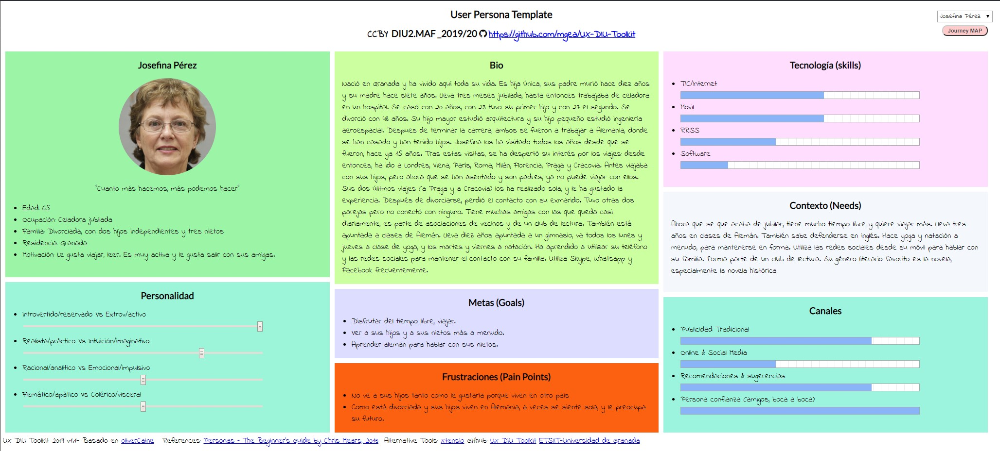
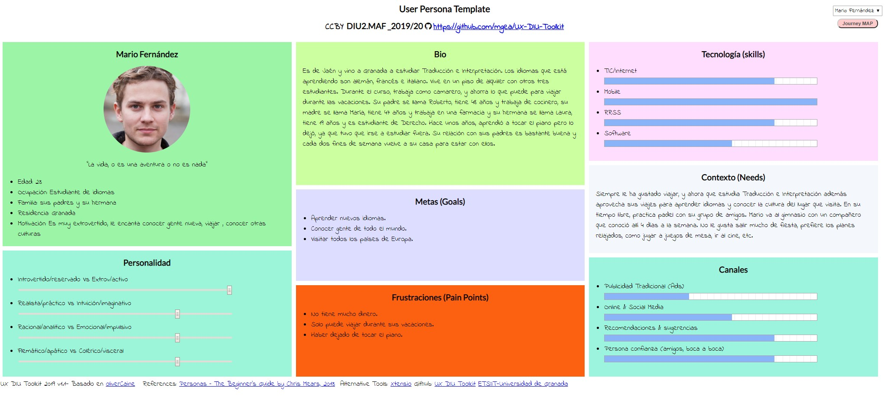
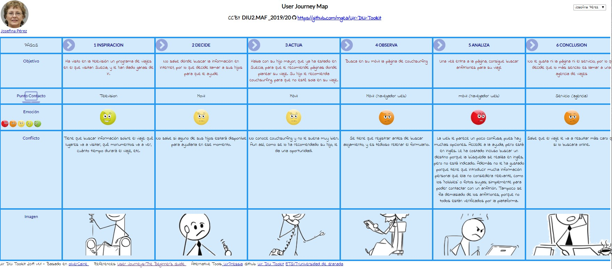
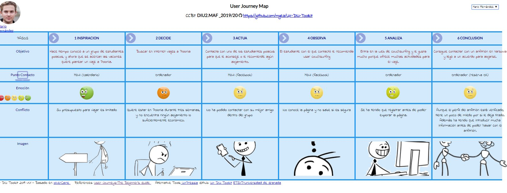

# DIU - Practica1, entregables

## Desk research: Análisis Competencia 

### ALTERNATIVA 1: [BADI](<https://badi.com/es/> )
 
Cuenta con una guía de uso en la página principal.
Buscador fácil de utilizar y muy completo, con opciones para ajustarse al presupuesto, número  de compañeros, etc.
Muestra mucha información de cada alojamiento: fotos, ubicación, disponibilidad, estancia mínima, compañeros de piso, tamaño de la habitación o piso, comodidades (calefacción, tv, etc.), entre otras.

### ALTERNATIVA 2: [COUCHSURFING](<https://www.couchsurfing.com/>)

No permite buscar alojamientos directamente, antes necesitas registrarte.
La páginas de términos y condiciones, ayuda y contacto  están en inglés directamente, no en español.
Una vez que te registras, ya puedes buscar alojamientos, grupos, eventos, etc. Aunque tiene muchas funcionalidades, es compleja en comparación con las otras alternativas y un poco confusa; hay demasiada información a la vez.

### ALTERNATIVA 3: [COMPARTE TU PISO](<https://compartetupiso.com/>)
  
No permite buscar alojamientos antes de registrarse (igual que couchsurfing).
Tiene muchos problemas: aunque tengamos la sesión iniciada, el botón de iniciar sesión sigue apareciendo, una vez que se cierra la sesión que se crea al registrarse  no se puede iniciar porque la página de inicio de sesión está incompleta (no tiene ni formulario); no se puede buscar (o al menos no fácilmente), etc.

### ALTERNATIVA 4: [PISO COMPARTIDO](<https://www.pisocompartido.com/>)
  
Puedes ver los pisos que disponibles antes de registrarte en la página.
El buscador está muy completo y tiene muchas opciones para buscar, aunque debería poderse filtrar por la edad de los compañeros. Al igual que badi, tiene mucha información sobre cada alojamiento.

Nuestra selección:
Hemos seleccionado Couchsurfing ya que parece que tiene un buen diseño, pero comparandola con las otras opciones, es más compleja y creemos que todavía tiene margen de mejora.

## Personas 

Hemos seleccionado a estas personas porque son perfiles muy distintos, pero a la vez son posibles usuarios de CouchSurfing.
- Josefina está divorciada, sus hijos no pueden acompañarla  y no tiene amigos que viajen, por lo tanto tiene que hacer los viajes sin que nadie la acompañe. Por ello, podría utilizar CouchSurfing para tener compañia y no sentirse sola en sus viajes.

- Mario es estudiante y no dispone de suficiente dinero, por lo que CouchSurfing es una alternativa a los viajes convencionales para ahorrar y seguir viajando. Además Mario estudia Traducción e Interpretación, por lo que le gusta mucho conocer a los nativos del lugar que está visitando e intentar aprender su idioma y costumbres.

  

[Ficha Josefina](img/PersonaJosefina.jpg "Josefina")  
[Ficha Mario](img/PersonaMario.jpg "Mario")  

## User Journey Map (1 por persona)

Hemos escogido estas experiencias de usuario porque reflejan la complejidad de la página:
- La experiencia de Josefina es negativa, porque hay demasiadas opciones en la página y tiene que introducir muchos datos para completar su perfil y poder hablar con anfitriones. Además, no le gustó que algunos elementos de la página estuvieran en inglés, como la ayuda o la búsqueda.
- La experiencia de Mario fue positiva, ya que consiguió contactar con un anfitrión en Polonia con el que llegó a un acuerdo para alojarse, aunque le pareció incómodo tener que introducir tanta información antes de poder hablar con los anfitriones.

  
  

[Journey Josefina](img/JourneyJosefina.jpg "Josefina")  
[Journey Mario](img/JourneyMario.jpg "Mario")

## Revisión de Usabilidad 

[Documento de revisión de usabilidad](UsabilityReviewCouchsurfing.pdf)  
Valoración final: 83 - Buena.  
La nota que ha obtenido Couchsurfing en el usability review es de 83. En general la página funciona correctamente y se merece buena nota.  
El mayor problema que hemos encontrado es la experiencia para un usuario nuevo. Cuando entra por primera vez a la página, ha de registrarse para poder buscar un alojamiento. Una vez que el usuario se ha registrado y accede a la página principal, le puede resultar compleja porque tiene muchas opciones, sobre todo si la comparamos con las otras alternativas (Badi, piso compartido). Tampoco ayuda mucho la página, no da un tour o un tutorial sobre como usarla. Si el usuario busca la ayuda, solo la va a encontrar en inglés, por lo que tiene que superar la barrera del idioma.  
Otro problema que tiene es la cantidad de información personal que el usuario nuevo ha de introducir para interactuar con otros usuarios. Ha de explicar sus gustos, los idiomas que habla, los países que ha visitado, un breve biografía, etc. Es quizás demasiada información para un usuario que acaba de llegar y no ha usado la página.
Realmente, una vez que el usuario se familiariza con la página, es bastante sencilla y funciona como uno se espera.