# DIU - Practica2, entregables

## Malla receptora de información 

| Interesante | Críticas   |
| ------------- | ------- |
| <ul><li>Dispone de diversas funcionalidades aparte de planificar una estancia, centradas en la comunicación entre usuarios: eventos, grupos, mensajes, etc.</li><li>Recomienda a los usuarios posibles destinos para viajar, indicando el número de anfitriones que hay en cada lugar</li><li> El buscador es completo y está disponible en todas las páginas.</li></ul> | <ul><li>En la web el buscador funciona solo en inglés. En la aplicación móvil también funciona en español (pero le da prioridad al inglés).</li><li>Los elementos de ayuda y más información solo están disponibles en inglés (tanto en la web como en la aplicación móvil)</li><li>No se pide confirmación al añadir una información, ni se puede deshacer fácilmente.</li><li>Para acceder a la página web y poder ver las funcionalidades que ofrece hay que registrarse.</li><li>Hay que introducir demasiados datos para interactuar con otros usuarios, reservar alojamiento, etc.</li></ul>|

| Preguntas | Nuevas ideas |
| ------------- | ------- |
|<ul><li>Poner la ayuda y la búsqueda en español.</li><li>Poder ver las funcionalidades antes de registrarse.</li><li>¿Por qué es necesario introducir tanta información “irrelevante” (como los hobbies, los libros que más me han gustado,...) para poder contactar con un anfitrión?</li></ul> | <ul><li>Realizar un tutorial rápido cuando el usuario se registre, para mostrarle las diferentes funcionalidades que ofrece la página.</li><li>Ofrecer páginas de ayuda y preguntas frecuentes en español además de inglés.</li><li>Dar al usuario la posibilidad de deshacer sus acciones y pedir confirmación para las acciones más importantes.</li><li>Añadir un apartado de consejos para viajes, que nos explique la cultura del lugar de destino, documentación que necesitemos, números de emergencias, etc.</li></ul>|

>  ¿Qué planteas como "propuesta de valor" para un nuevo diseño de aplicación para economia colaborativa?
> (150-200 caracteres)

Como propuesta de valor se nos ha ocurrido añadir un tutorial que muestre a los usuarios más novatos las distintas funcionalidades que ofrece el sistema en detalle y de una forma sencilla. Así, cuando un usuario se registre y acceda por primera vez al sistema, no resultará abrumado por todas las opciones que se muestran en el menú y en la pantalla principal.

También traduciremos las páginas de ayuda, soporte, preguntas frecuentes, etc. a español. Aunque Couchsurfing se basa en una comunidad internacional y tiene muchos usuarios que dominan el inglés, creemos que elementos tan básicos como la ayuda deberían estar disponibles en español.

Asimismo añadiremos una nueva funcionalidad para que los usuarios puedan compartir información sobre los diferentes destinos: avisos, consejos y recomendaciones sobre la documentación, medios de transporte recomendados, información sobre las autoridades, leyes, costumbres importantes, festividades, etc. En esta nueva funcionalidad también proponemos añadir un apartado de noticias, eventos o avisos importantes relacionados con los viajes en el destino (por ejemplo, informar de que ya no se puede viajar a un país debido a que ha cerrado sus fronteras).

## Sitemap & Task flow 

User/task matrix:

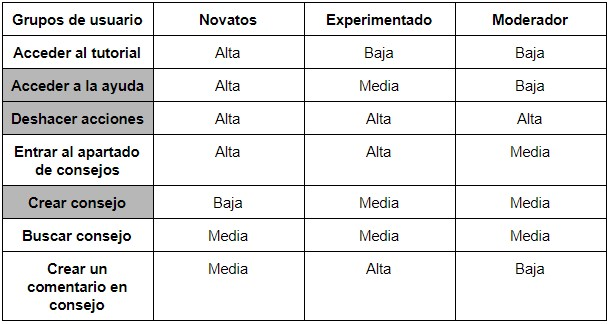 

Hemos elegido la matriz de tareas ya que nos permite representar la importancia de cada tarea para cada grupo de usuario y por lo tanto se adapta mejor a las nuevas propuestas que hemos hecho. También nos permite destacar las tareas que son más críticas e importantes, que son:
* Acceder a la ayuda, ya que es clave que los usuarios novatos puedan consultarla de una manera sencilla.
* Deshacer acciones, para evitar errores a la hora de mandar mensajes, escribir comentarios, etc.
* Crear consejo, porque es la funcionalidad más importante del sistema de consejos que hemos creado. Si los usuarios no pueden crear consejos de una forma fácil, no se  verán incentivados a crearlos, por lo que habrá pocos consejos y este sistema no se utilizará mucho.

Sitemap:

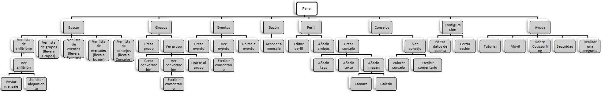

[Sitemap (pdf)](sitemap.pdf) 

## Labelling 

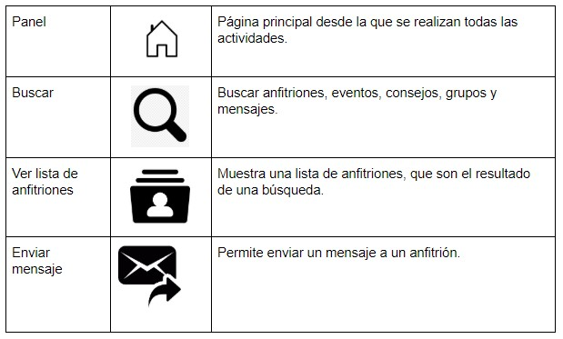
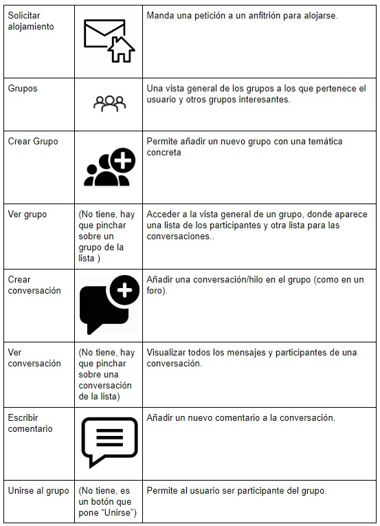 
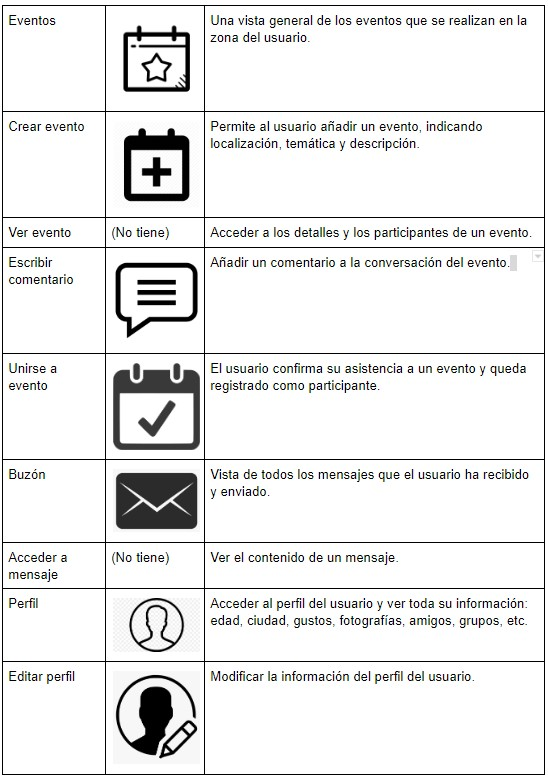 
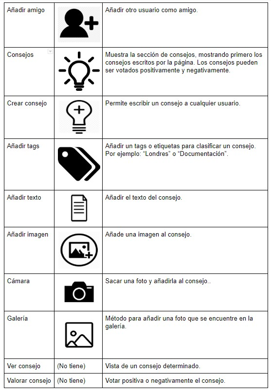 
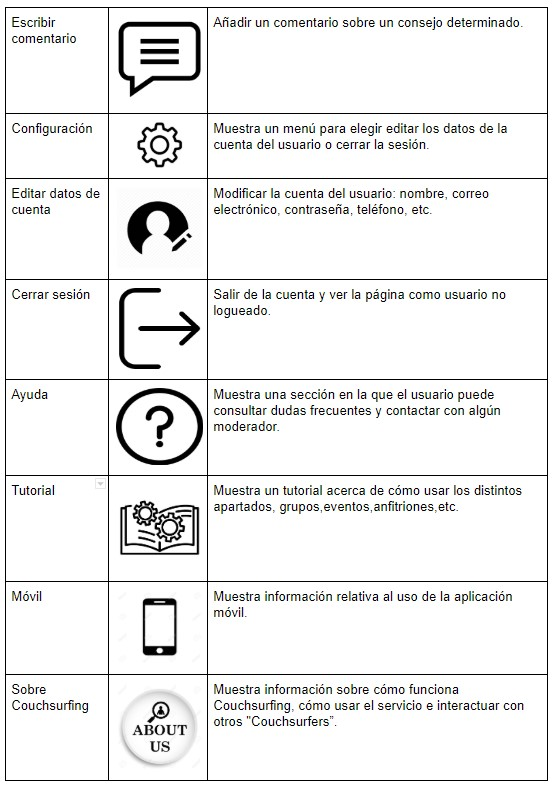
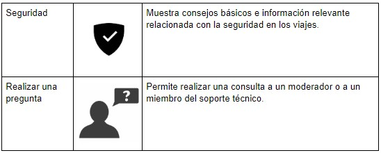 

## Wireframes

[Bocetos (pdf)](BocetoLofi.pdf)

Boceto del Panel (pantalla principal)

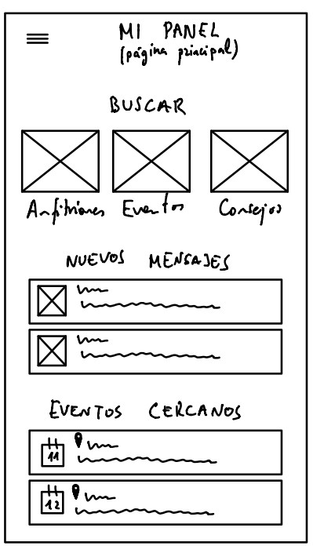 

Boceto del Menú

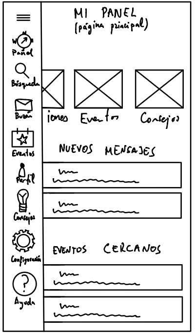 

Boceto de la página de consejos

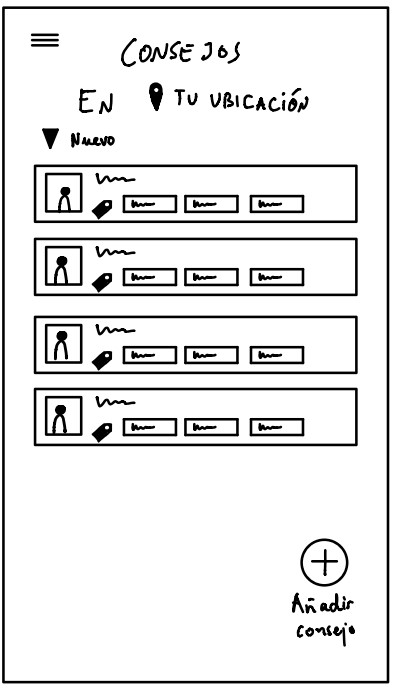 

 Boceto de la vista de un consejo

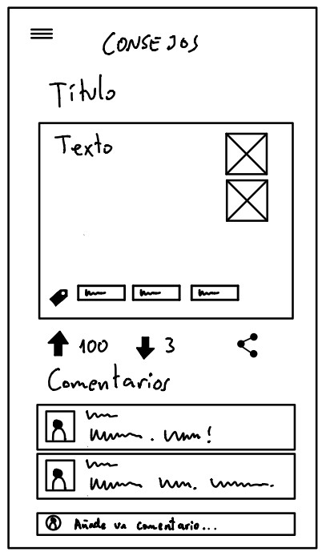

Boceto de la página para añadir un nuevo consejo

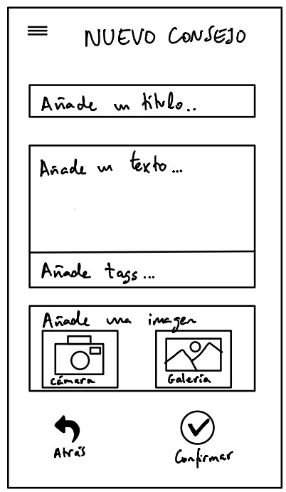

 Boceto del menú para confirmar el envío de un consejo

 
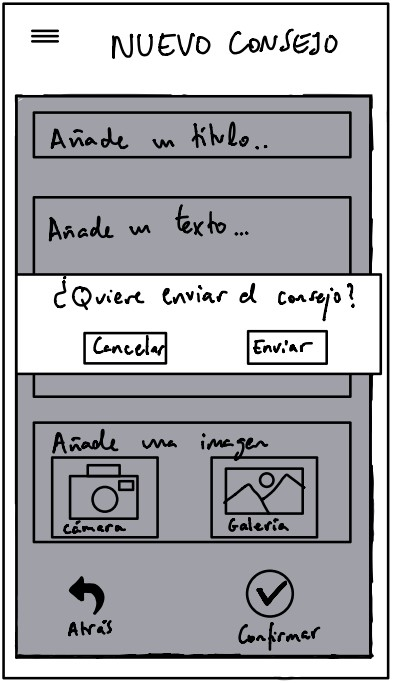

Boceto del menú para descartar un consejo

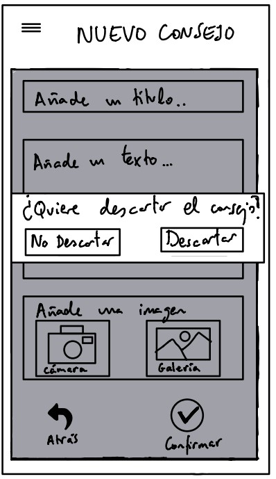 

Boceto de la página de ayuda

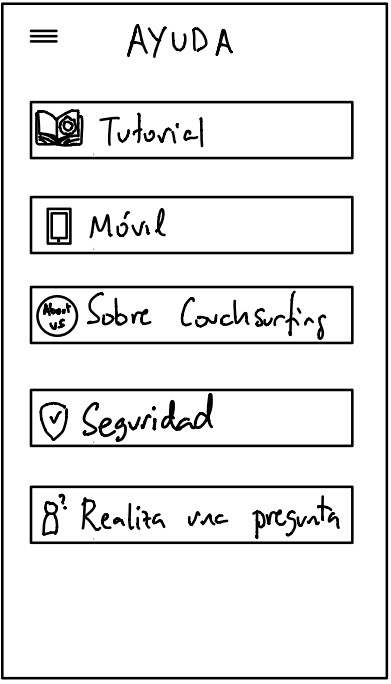 

En el panel (que es la página principal), se muestra un menú rápido para buscar, eventos cercanos, mensajes y comentarios nuevos, etc.
Hemos creado un menú que se despliega y se esconde para que el usuario disponga de una visión más limpia del contenido, pero sin perder las funcionalidades del menú.

Los consejos se buscan dependiendo de una ubicación y se pueden filtrar por nuevos, más votados, etc. Cuando seleccionas un consejo, puedes ver el título, el texto, las imágenes, los comentarios asociados y los votos que este ha recibido.
A la hora de escribir un nuevo consejo, hay que añadir un título, un texto, las etiquetas (tags), y opcionalmente se pueden añadir imágenes. Estas pueden subirse tanto de la cámara como de la galería. 

Hemos añadido también un menú para confirmar que el usuario quiere enviar o descartar un consejo, lo cual reduce las posibilidades de que el usuario pueda enviar o descartar un consejo accidentalmente. Esta funcionalidad podría estar también en otras páginas del sistema, como en los eventos y mensajes.

En la pantalla de ayuda hay varias opciones: acceder un tutorial para entender las funcionalidades de la página, información sobre el uso de la aplicación móvil,  información sobre couchsurfing, consejos e información relativa a la seguridad y realizar una pregunta a un administrador de la página o un moderador.
