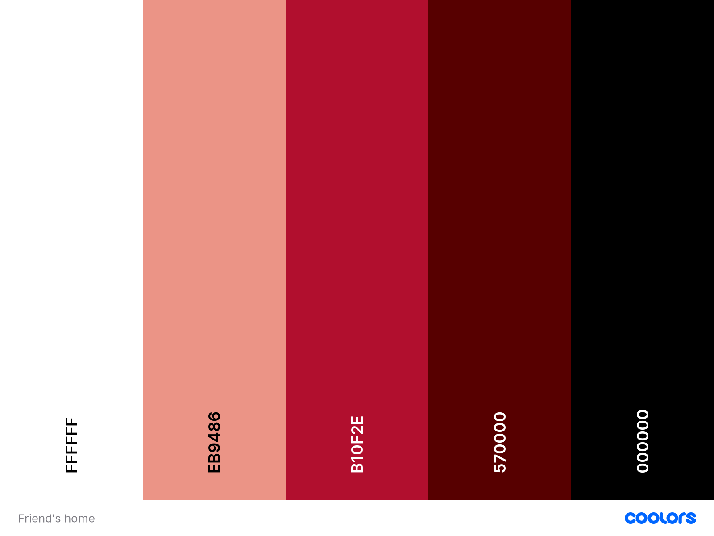
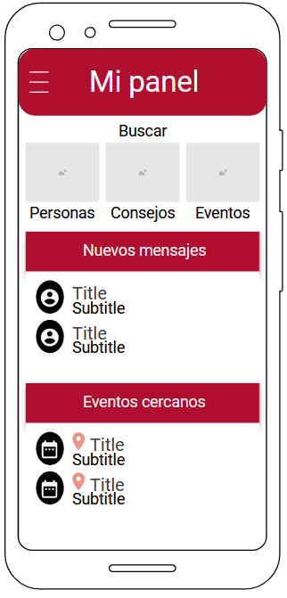

# DIU - Practica 3, entregables

## Análisis de MuseMap   
MuseMap es una aplicación cuyo objetivo es incentivar a la gente para que visiten y aprecien el arte público de Londres. Permite identificar a los artistas que han creado las obras que se encuentran por la calle y compartir imágenes de dichas obras, de forma que los usuarios puedan localizarlas y visitarlas.

El equipo de diseño creó un cliente ficticio (la Ciudad de Londres), para entender mejor los objetivos que debería cumplir MuseMap. En nuestra práctica no hemos propuesto un cliente ficticio, pero creemos que tenerlo puede ser útil para entender mejor el caso y enfocarlo como si se tratara de un caso real.

Lo primero que el equipo de diseño se planteó fue la necesidad de investigar las inquietudes y los hábitos de los potenciales usuarios de MuseMap. Para ello, fueron a Hyde Park para observar cómo se comportaban las personas que visitaban la [Mastaba](https://www.royalparks.org.uk/parks/hyde-park/hyde-park-news/the-mastaba) (etnografía).

Tras ello, realizaron un análisis de la competencia (Competitive Analysis), que nosotros también realizamos, aunque con menor profundidad. De esta forma, entendieron qué funcionalidades implementaban todas las aplicaciones de la competencia (aquellas funcionalidades “esenciales” con las que MuseMap debía contar para ser competitiva); y qué funcionalidades podría implementar Muse Map para diferenciarse de la competencia.

Dado que el equipo de diseño quería realizar entrevistas con posibles usuarios, antes de ello diseñaron un mapa de empatía (Empathy Map), para entender mejor a los potenciales usuarios y poder preguntarles sobre los puntos más importantes.

Tras haber realizado el mapa de empatía, seleccionaron (mediante una encuesta) a posibles usuarios y los entrevistaron. Con los datos que obtuvieron de dichas entrevistas, realizaron un mapa de Afinidad (Affinity Mapping) y sacaron conclusiones (insights) sobre las funciones que realmente son importantes para los usuarios. 

Nosotros no hemos realizado ninguna de estas técnicas en nuestra práctica, pero vemos que son muy útiles, porque aseguran que sabemos y entendemos las funcionalidades que realmente son importantes para los posibles usuarios. Esto nos permite que podamos crear personas ficticias similares a los usuarios finales, por lo que entenderemos mejor sus necesidades a la hora de diseñar la aplicación.

Al igual que en nuestra práctica, el equipo de diseño de MuseMap ha creado dos personas ficticias (User Personas). Seguramente estas dos personas que han creado serán más parecidas a los potenciales usuarios que las que nosotros hemos creado (por lo que hemos comentado en el párrafo anterior).

Después de crear y analizar a las personas, realizan solo un Journey Map, para la primera persona ficticia. En cambio, nosotros realizamos un Journey Map para cada persona.

Tras ello, el equipo de diseño de MuseMap analiza más a fondo el Journey Map que han creado, usando un Experience map y escenarios (User Scenarios) para entender el problema que se les plantea. Sin embargo, nosotros usamos una revisión de usabilidad (Usability Review) para profundizar con más detalle en una de las aplicaciones que ofrece la competencia. En ambos casos, el objetivo de aplicar las técnicas es buscar los problemas que tienen los usuarios, ya sea con una aplicación en concreto (Usability Review) o en general (Experience Map + User Scenarios).

En este punto ya han encontrado el problema que quieren resolver, por lo que pasan a la fase de diseño. Para ello, empiezan definiendo un User Flow, mientras que nosotros realizamos una Feedback Capture Grid.

Tras ello, realizan unos bocetos (muy básicos y no reflejan el diseño de la aplicación), para obtener nuevas ideas. El resultado de nuestra Feedback Capture Grid y estos bocetos es similar: el equipo tiene nuevas ideas para el diseño. Sin embargo, con el Feedback Capture Grid también entendemos los puntos fuertes y débiles.

Para entender qué funciones son más importantes a la hora de usar la aplicación, los diseñadores de MuseMap realizan una Feature Prioritisation. Nosotros realizamos una matriz de tareas, que igualmente nos permite entender la importancia de las distintas tareas/funciones.

Después, realizaron un primer boceto Lo-Fi (wireframes) en papel, con poco detalle, que mostraba las funciones básicas de la aplicación. Enseñaron este primer prototipo a los potenciales usuarios (usability testing), y tras recibir su feedback, realizaron una segunda ronda de bocetos Lo-Fi (wireframes). Como ya estaban conformes con esta versión, procedieron a diseñar los bocetos Hi-Fi usando la herramienta Sketch.

Volvieron a enseñar estos bocetos Hi-Fi a los potenciales usuarios, y tras ello, crearon la versión final de los bocetos, que tenía en cuenta las opiniones y comentarios que habían realizado los usuarios.

Una vez terminados los bocetos, realizaron un Site Map (que también realizamos en nuestra práctica), desarrollaron la guía de estilo de MuseMap, y por último realizaron los Mock-Up finales con el diseño de la aplicación.

Hay varias diferencias con lo que nosotros tenemos en nuestra práctica. Por ejemplo, no hemos desarrollado una guía de estilo, no hemos creado bocetos Hi-Fi,  ni hemos podido preguntar ni interactuar con los posibles usuarios. 

Como conclusión, aunque los métodos que hemos realizado son relativamente similares a los usa el equipo de diseño de MuseMap, nos falta aplicar algunos métodos basados en la interacción con los usuarios (como el Empathy map, entrevistas/preguntas a los usuarios, Affinity Mapping). También sería muy interesante la posibilidad de mostrar nuestros bocetos a los usuarios, para que podamos adaptarlos a sus indicaciones. De esta forma tendríamos más seguridad a la hora de empezar el desarrollo de la aplicación.

## Propuesta de elementos de diseño o patrones a usar 

Nuestra aplicación se desarrollará para dispositivos Android, por lo que sería recomendable utilizar las [guidelines que nos proporciona Google](https://www.thinkwithgoogle.com/_qs/documents/1714/Google_Guia_UX_uBbvE4i.pdf).

 Los principios de diseño de las aplicaciones para dispositivos móviles más importantes que nos recomiendan son:

  * Permitir que los usuarios puedan volver atrás en un paso.
  * Permitir que el usuario pueda cambiar el lugar fácilmente de forma manual.
  * Incluir el campo de búsqueda en una posición destacada.
  * Usar un método de indexación de búsqueda eficaz.
  * Proporcionar opciones para filtrar y ordenar los resultados
  * Permitir ver y filtrar las opiniones de los usuarios
  * Ofrecer una utilidad clara antes de solicitar a los usuarios que se registren.
  * Marcar la diferencia entre las opciones para “acceder” y “registrarse”.
  * Informar los errores del formulario en tiempo real. 
  * Proporcionar información contextual útil en los formularios. 
  * Usar el mismo vocabulario que los usuarios de su aplicación. 
  * Solicitar permisos en un contexto relevante.

Si respetamos estos principios de diseño (que tienen en común las aplicaciones de Android), los usuarios no tendrán que realizar el esfuero extra de aprender a usar nuestra aplicación; por tanto, es más probable que su experiencia sea positiva.

La paleta de colores la hemos generado usando la herramienta [coolors](https://coolors.co/). 

[Paleta](img/paleta.png "Paleta"):

La tipografía que vamos a utilizar es [Roboto](https://fonts.google.com/specimen/Roboto), una fuente de Google, limpia y minimalista.

Aquí adjuntamos un [prototipo](img/BocetoConPaleta.png "Prototipo") de la página principal (panel) en el que se muestra la paleta y la tipografía:

## Historia en Video del UX Case Study

## Documentación. Valoración del equipo sobre la realización de esta práctica o los problemas surgidos
 