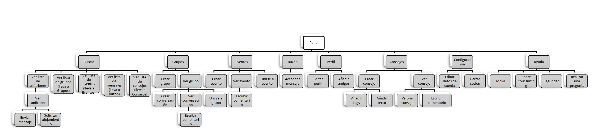

# DIU20
Prácticas Diseño Interfaces de Usuario 2019-20 (Economía Colaborativa)

Grupo: DIU2.MAF.  Curso: 2019/20

Proyecto:

Descripción:

Logotipo:

Miembros
 * :bust_in_silhouette:  Francisco José Molina Sánchez     :octocat:  
  [@franmolsan](https://github.com/franmolsan)
 * :bust_in_silhouette:  Miguel Ángel Molina Jordán     :octocat:  
  [@MangelMolina](https://github.com/MangelMolina)

-----

En esta práctica estudiaremos un caso de plataforma de economía colaborativa y realizaremos una propuesta para su diseño Web/movil. Utilizaremos herramientas y entregables descritos en el siguiente CheckList (https://github.com/mgea/UX-DIU-Checklist)

Qué es economia colaborativa: Martínez-Polo, J. (2019). **El fenómeno del consumo colaborativo: del intercambio de bienes y servicios a la economía de las plataformas**, *Sphera Publica, 1*(19), 24-46. http://sphera.ucam.edu/index.php/sphera-01/article/view/363/14141434

>>> Este documento es el esqueleto del report final de la práctica. Aparte de subir cada entrega a PRADO, se debe actualizar y dar formato de informe final a este documento online.

# Proceso de Diseño

## Paso 1. UX Desk Research & Analisis

 1.a Competitive Analysis
-----

### ALTERNATIVA 1: BADI
<https://badi.com/es/>  
Cuenta con una guía de uso en la página principal.
Buscador fácil de utilizar y muy completo, con opciones para ajustarse al presupuesto, número  de compañeros, etc.
Muestra mucha información de cada alojamiento: fotos, ubicación, disponibilidad, estancia mínima, compañeros de piso, tamaño de la habitación o piso, comodidades (calefacción, tv, etc.), entre otras.

### ALTERNATIVA 2: COUCHSURFING
<https://www.couchsurfing.com/>  
No permite buscar alojamientos directamente, antes necesitas registrarte.
La páginas de términos y condiciones, ayuda y contacto  están en inglés directamente, no en español.
Una vez que te registras, ya puedes buscar alojamientos, grupos, eventos, etc. Aunque tiene muchas funcionalidades, es compleja en comparación con las otras alternativas y un poco confusa; hay demasiada información a la vez.

### ALTERNATIVA 3: COMPARTE TU PISO
<https://compartetupiso.com/>  
No permite buscar alojamientos antes de registrarse (igual que couchsurfing).
Tiene muchos problemas: aunque tengamos la sesión iniciada, el botón de iniciar sesión sigue apareciendo, una vez que se cierra la sesión que se crea al registrarse  no se puede iniciar porque la página de inicio de sesión está incompleta (no tiene ni formulario); no se puede buscar (o al menos no fácilmente), etc.

### ALTERNATIVA 4: PISO COMPARTIDO
<https://www.pisocompartido.com/>  
Puedes ver los pisos que disponibles antes de registrarte en la página.
El buscador está muy completo y tiene muchas opciones para buscar, aunque debería poderse filtrar por la edad de los compañeros. Al igual que badi, tiene mucha información sobre cada alojamiento.

Hemos seleccionado Couchsurfing ya que parece que tiene un buen diseño, pero comparandola con las otras opciones, es más compleja y creemos que todavía tiene margen de mejora.

 1.b Persona
-----
Hemos seleccionado a estas personas porque son perfiles muy distintos, pero a la vez son posibles usuarios de CouchSurfing.
- Josefina está divorciada, sus hijos no pueden acompañarla  y no tiene amigos que viajen, por lo tanto tiene que hacer los viajes sin que nadie la acompañe. Por ello, podría utilizar CouchSurfing para tener compañia y no sentirse sola en sus viajes.

- Mario es estudiante y no dispone de suficiente dinero, por lo que CouchSurfing es una alternativa a los viajes convencionales para ahorrar y seguir viajando. Además Mario estudia Traducción e Interpretación, por lo que le gusta mucho conocer a los nativos del lugar que está visitando e intentar aprender su idioma y costumbres.

  

[Ficha Josefina](P1/PersonaJosefina.jpg "Josefina")  
[Ficha Mario](P1/PersonaMario.jpg "Mario")  

 1.c User Journey Map
----
Hemos escogido estas experiencias de usuario porque reflejan la complejidad de la página:
- La experiencia de Josefina es negativa, porque hay demasiadas opciones en la página y tiene que introducir muchos datos para completar su perfil y poder hablar con anfitriones. Además, no le gustó que algunos elementos de la página estuvieran en inglés, como la ayuda o la búsqueda.
- La experiencia de Mario fue positiva, ya que consiguió contactar con un anfitrión en Polonia con el que llegó a un acuerdo para alojarse, aunque le pareció incómodo tener que introducir tanta información antes de poder hablar con los anfitriones.

  
  

[Journey Josefina](P1/JourneyJosefina.jpg "Josefina")  
[Journey Mario](P1/JourneyMario.jpg "Mario")

 1.d Usability Review
----

[Documento de revisión de usabilidad](P1/UsabilityReviewCouchsurfing.pdf)  
Valoración final: 83 - Buena.  
La nota que ha obtenido Couchsurfing en el usability review es de 83. En general la página funciona correctamente y se merece buena nota.  
El mayor problema que hemos encontrado es la experiencia para un usuario nuevo. Cuando entra por primera vez a la página, ha de registrarse para poder buscar un alojamiento. Una vez que el usuario se ha registrado y accede a la página principal, le puede resultar compleja porque tiene muchas opciones, sobre todo si la comparamos con las otras alternativas (Badi, piso compartido). Tampoco ayuda mucho la página, no da un tour o un tutorial sobre como usarla. Si el usuario busca la ayuda, solo la va a encontrar en inglés, por lo que tiene que superar la barrera del idioma.  
Otro problema que tiene es la cantidad de información personal que el usuario nuevo ha de introducir para interactuar con otros usuarios. Ha de explicar sus gustos, los idiomas que habla, los países que ha visitado, un breve biografía, etc. Es quizás demasiada información para un usuario que acaba de llegar y no ha usado la página.
Realmente, una vez que el usuario se familiariza con la página, es bastante sencilla y funciona como uno se espera.

## Paso 2. UX Design  

 2.a Feedback Capture Grid
----

>>> Comenta con un diagrama los aspectos más destacados a modo de conclusion de la práctica anterior,

| Interesante | Críticas   |
| ------------- | ------- |
| <ul><li>Dispone de diversas funcionalidades aparte de planificar una estancia, centradas en la comunicación entre usuarios: eventos, grupos, mensajes, etc.</li><li>Recomienda a los usuarios posibles destinos para viajar, indicando el número de anfitriones que hay en cada lugar</li><li> El buscador es completo y está disponible en todas las páginas.</li></ul> | <ul><li>En la web el buscador funciona solo en inglés. En la aplicación móvil también funciona en español (pero le da prioridad al inglés).</li><li>Los elementos de ayuda y más información solo están disponibles en inglés (tanto en la web como en la aplicación móvil)</li><li>No se pide confirmación al añadir una información, ni se puede deshacer fácilmente.</li><li>Para acceder a la página web y poder ver las funcionalidades que ofrece hay que registrarse.</li><li>Hay que introducir demasiados datos para interactuar con otros usuarios, reservar alojamiento, etc.</li></ul>|

| Preguntas | Nuevas ideas |
| ------------- | ------- |
|<ul><li>Poner la ayuda y la búsqueda en español.</li><li>Poder ver las funcionalidades antes de registrarse.</li><li>¿Por qué es necesario introducir tanta información “irrelevante” (como los hobbies, los libros que más me han gustado,...) para poder contactar con un anfitrión?</li></ul> | <ul><li>Realizar un tutorial rápido cuando el usuario se registre, para mostrarle las diferentes funcionalidades que ofrece la página.</li><li>Ofrecer páginas de ayuda y preguntas frecuentes en español además de inglés.</li><li>Dar al usuario la posibilidad de deshacer sus acciones y pedir confirmación para las acciones más importantes.</li><li>Añadir un apartado de consejos para viajes, que nos explique la cultura del lugar de destino, documentación que necesitemos, números de emergencias, etc.</li></ul>|

>>> ¿Que planteas como "propuesta de valor" para un nuevo diseño de aplicación para economia colaborativa ?
>>> Problema e hipótesis
>>>  Que planteas como "propuesta de valor" para un nuevo diseño de aplicación para economia colaborativa te
>>> (150-200 caracteres)

Como propuesta de valor se nos ha ocurrido añadir un tutorial que muestre a los usuarios más novatos las distintas funcionalidades que ofrece el sistema en detalle y de una forma sencilla. Así, cuando un usuario se registre y acceda por primera vez al sistema, no resultará abrumado por todas las opciones que se muestran en el menú y en la pantalla principal.

También traduciremos las páginas de ayuda, soporte, preguntas frecuentes, etc. a español. Aunque Couchsurfing se basa en una comunidad internacional y tiene muchos usuarios que dominan el inglés, creemos que elementos tan básicos como la ayuda deberían estar disponibles en español.

Asimismo añadiremos una nueva funcionalidad para que los usuarios puedan compartir información sobre los diferentes destinos: avisos, consejos y recomendaciones sobre la documentación, medios de transporte recomendados, información sobre las autoridades, leyes, costumbres importantes, festividades, etc. En esta nueva funcionalidad también proponemos añadir un apartado de noticias, eventos o avisos importantes relacionados con los viajes en el destino (por ejemplo, informar de que ya no se puede viajar a un país debido a que ha cerrado sus fronteras).

 2.b Tasks & Sitemap
-----

>>> Definir "User Map" y "Task Flow" ...

User/task matrix:

| Grupos de usuario              | Novatos | Experimentado | Moderador |
|--------------------------------|---------|---------------|-----------|
| Acceder al tutorial            | Alta    | Baja          | Baja      |
| Acceder a la ayuda             | Alta    | Media         | Baja      |
| Deshacer acciones              | Alta    | Alta          | Alta      |
| Entrar al apartado de consejos | Alta    | Alta          | Media     |
| Crear consejo                  | Baja    | Media         | Media     |
| Buscar consejo                 | Media   | Media         | Media     |
| Crear un comentario en consejo | Media   | Alta          | Baja      |

[Sitemap (pdf)](P2/sitemap.pdf) 

 2.c Labelling
----

>>> Identificar términos para diálogo con usuario  

| Término                  | Significado                                                                                                                                           |
|--------------------------|-------------------------------------------------------------------------------------------------------------------------------------------------------|
| Panel                    | Página principal desde la que se realizan todas las actividades.                                                                                      |
| Buscar                   | Buscar anfitriones, eventos, consejos, grupos y mensajes.                                                                                             |
| Ver lista de anfitriones | Muestra una lista de anfitriones, que son el resultado de una búsqueda.                                                                               |
| Enviar mensaje           | Permite enviar un mensaje a un anfitrión                                                                                                              |
| Solicitar alojamiento    | Manda una petición a un anfitrión para alojarse.                                                                                                      |
| Grupos                   | Una vista general de los grupos a los que pertenece el usuario y otros grupos interesantes                                                            |
| Crear Grupo              | Permite añadir un nuevo grupo con una temática concreta                                                                                               |
| Ver grupo                | Acceder a la vista general de un grupo, donde aparecen los participantes, las conversaciones, etc.                                                    |
| Crear conversación       | Añadir una conversación/hilo en el grupo (como en un foro).                                                                                           |
| Ver conversación         | Visualizar todos los mensajes y participantes de una conversación.                                                                                    |
| Escribir comentario      | Añadir un nuevo comentario a la conversación.                                                                                                         |
| Unirse al grupo          | Permite al usuario ser participante del grupo.                                                                                                        |
| Eventos                  | Una vista general de los eventos que se realizan en la zona del usuario.                                                                              |
| Crear evento             | Permite al usuario añadir un evento, indicando localización, temática y descripción.                                                                  |
| Ver evento               | Acceder a los detalles y los participantes de un evento.                                                                                              |
| Escribir comentario      | Añadir un comentario a la conversación del evento.                                                                                                    |
| Unirse a evento          | El usuario confirma su asistencia a un evento y queda registrado como participante.                                                                   |
| Buzón                    | Vista de todos los mensajes que el usuario ha recibido y enviado.                                                                                     |
| Acceder a mensaje        | Ver el contenido de un mensaje.                                                                                                                       |
| Perfil                   | Acceder al perfil del usuario y ver toda su información: edad, ciudad, gustos, fotografías, amigos, grupos, etc.                                      |
| Editar perfil            | Modificar la información del perfil del usuario.                                                                                                      |
| Añadir amigo             | Añadir otro usuario como amigo.                                                                                                                       |
| Consejos                 | Muestra la sección de consejos, mostrando primero los consejos más relevantes y los escritos por los moderadores.                                     |
| Crear consejo            | Permite escribir un consejo a cualquier usuario.                                                                                                      |
| Añadir tags              | Añadir tags o etiquetas para clasificar un consejo. Por ejemplo: “Londres”, “Documentación”, "Gangas" o "Locales".                                    |
| Añadir texto             | Añadir el texto del consejo.                                                                                                                          |
| Ver consejo              | Vista de un consejo determinado.                                                                                                                      |
| Valorar consejo          | Votar positiva o negativamente el consejo.                                                                                                            |
| Escribir comentario      | Añadir un comentario sobre un consejo determinado.                                                                                                    |
| Configuración            | Muestra un menú para elegir editar los datos de la cuenta del usuario o cerrar la sesión.                                                             |
| Editar datos de cuenta   | Modificar la cuenta del usuario: nombre, correo electrónico, contraseña, teléfono, etc.                                                               |
| Cerrar sesión            | Salir de la cuenta y ver la página como usuario no logueado.                                                                                          |
| Ayuda                    | Muestra una sección en la que el usuario puede consultar dudas frecuentes y contactar con algún moderador.                                            |
| Móvil                    | Muestra información relativa al uso de la aplicación móvil.                                                                                           |
| Sobre Couchsurfing       | Muestra información sobre cómo funciona Couchsurfing, cómo usar el servicio e interactuar con otros "Couchsurfers”                                    |
| Seguridad                | Muestra consejos básicos e información relevante relacionada con la seguridad en los viajes.                                                          |
| Realizar una pregunta    | Permite realizar una consulta a un moderador o a un miembro del soporte técnico. 

 2.d Wireframes
-----

>>> Plantear el  diseño del layout para Web/movil (organización y simulación )

## Paso 3. Make (Prototyping)

 3.a Moodboard
-----

>>> Plantear Diseño visual con una guía de estilos visual (moodboard)

  3.b Landing Page
----

>>> Plantear Landing Page

 3.c Guidelines
----

>>> Estudio de Guidelines y Patrones IU a usar

  3.d Mockup
----

>>> Layout: Mockup / prototipo HTML  (que permita simular tareas con estilo de IU seleccionado)

## Paso 4. UX Check (Usability Testing)

 4.a A/B Testing
----

>>> Comprobacion de asignaciones para A/B Testing. Asignaciones https://github.com/mgea/DIU19/blob/master/ABtesting.md

>>>> Práctica A:

 4.b User Testing
----

>>> Usuarios para evaluar prácticas

| Usuarios | Sexo/Edad     | Ocupación   |  Exp.TIC    | Personalidad | Plataforma | TestA/B
| ------------- | -------- | ----------- | ----------- | -----------  | ---------- | ----
| User1's name  | H / 18   | Estudiante  | Media       | Introvertido | Web.       | A
| User2's name  | H / 18   | Estudiante  | Media       | Timido       | Web        | A
| User3's name  | M / 35   | Abogado     | Baja        | Emocional    | móvil      | B
| User4's name  | H / 18   | Estudiante  | Media       | Racional     | Web        | B

. 4.c Cuestionario SUS
----

>>> Usaremos el **Cuestionario SUS** para valorar la satisfacción de cada usuario con el diseño (A/B) realizado. Para ello usamos la [hoja de cálculo](https://github.com/mgea/DIU19/blob/master/Cuestionario%20SUS%20DIU.xlsx) para calcular resultados sigiendo las pautas para usar la escala SUS e interpretar los resultados
http://usabilitygeek.com/how-to-use-the-system-usability-scale-sus-to-evaluate-the-usability-of-your-website/)
Para más información, consultar aquí sobre la [metodología SUS](https://cui.unige.ch/isi/icle-wiki/_media/ipm:test-suschapt.pdf)

>>> Adjuntar captura de imagen con los resultados + Valoración personal

 4.c Usability Report
----

>> Añadir report de usabilidad para práctica B

## Paso 5. Evaluación de Accesibilidad  

  5.a Accesibility evaluation Report
----

>>> Indica qué pretendes evaluar (de accesibilidad) y qué resultados has obtenido + Valoración personal

>>> Evaluación de la Accesibilidad (con simuladores o verificación de WACG)

## Conclusión / Valoración de las prácticas

>>> (90-150 caracteres) Opinión del proceso de desarrollo de diseño siguiendo metodología UX y valoración (positiva /negativa) de los resultados obtenidos  
